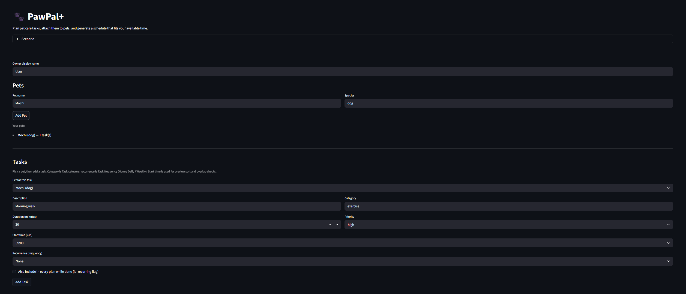
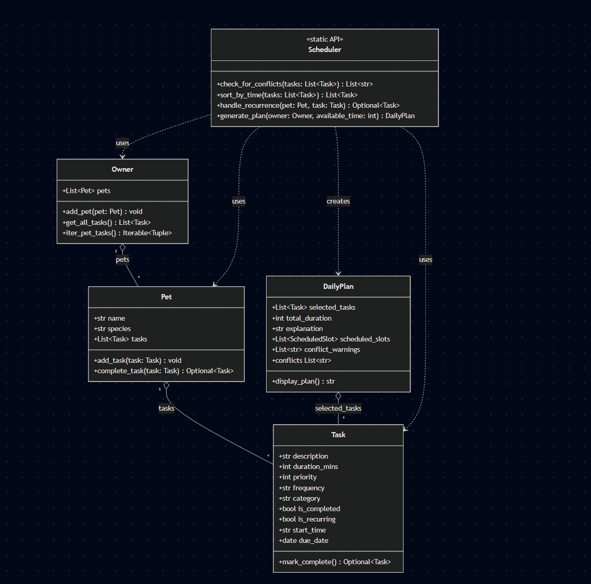

# PawPal+

**An AI-powered pet care scheduling assistant that generates optimized daily plans and explains them using retrieval-augmented generation.**



> **Base project:** PawPal+ (Modules 1–3 scheduling system) | **Reflection & AI ethics:** [model_card.md](model_card.md)

---

## Demo Walkthrough

[](https://www.loom.com/share/c98ba675e737488c94f649de541b8323)

---

## Original Project (Modules 1–3)

**PawPal+** began as a Streamlit-based scheduling application for busy multi-pet households. Its original goals were to let pet owners register their animals, define care tasks with duration and priority, and receive an optimized daily plan that fit within a stated time budget. The core system tracked recurring tasks (daily medications, weekly grooming), detected time-slot conflicts, and explained its scheduling choices in plain language — all without any external AI services.

---

## Title and Summary

**PawPal+** helps busy pet owners stop forgetting who needs what and when. You tell it your pets, your tasks, and how much time you have today. It generates a priority-weighted schedule, flags double-booked slots, and — using a Gemini-powered AI layer grounded in a curated knowledge base — delivers a plain-English explanation of *why* that plan is the right one for your animals.

**Why it matters:** Pet care errors (missed medications, skipped walks, late feedings) have real welfare consequences. A scheduling tool that explains its recommendations in expert-backed language helps owners make confident, informed decisions rather than guessing.

---

## Architecture Overview

The system is structured as four cooperating layers:

```
┌─────────────────────────────────────────────────────┐
│                  Streamlit UI (app.py)               │
│  Owner & pet setup → task entry → schedule display  │
└────────────────────────┬────────────────────────────┘
                         │
┌────────────────────────▼────────────────────────────┐
│           Scheduling Engine (pawpal_system.py)       │
│  Task / Pet / Owner dataclasses                      │
│  Scheduler: priority packing, conflict detection,    │
│  recurrence, walk/groom exclusivity constraints      │
└──────────┬──────────────────────────┬───────────────┘
           │                          │
┌──────────▼──────────┐  ┌───────────▼────────────────┐
│  RAG Retriever       │  │   AI Explainer             │
│  (rag_retriever.py)  │  │   (ai_explainer.py)        │
│  Looks up relevant   │  │   Sends scheduled tasks +  │
│  care guidelines     │  │   retrieved facts to       │
│  from knowledge base │  │   Gemini 2.5 Flash Lite    │
└──────────┬──────────┘  └───────────┬────────────────┘
           │                          │
┌──────────▼──────────┐  ┌───────────▼────────────────┐
│  pet_care_kb.json    │  │   Google Gemini API        │
│  Expert guidelines   │  │   (external, optional)     │
│  by species +        │  │   Graceful fallback if     │
│  care category       │  │   key is missing           │
└─────────────────────┘  └────────────────────────────┘
```

**Key design principle:** The scheduling engine has zero knowledge of AI or the UI. This means you can unit-test every scheduling behavior directly, and the AI explanation layer is fully optional — if the API key is absent or the call fails, the app continues working with a rule-based fallback.

**UML class diagram** (see [`assets/UML.png`](assets/UML.png)):



---

## Setup Instructions

**Prerequisites:** Python 3.10+, a Google Gemini API key (free tier works)

### 1. Clone the repository

```bash
git clone https://github.com/your-username/applied-ai-system-project.git
cd applied-ai-system-project
```

### 2. Create and activate a virtual environment

```bash
python -m venv .venv

# macOS / Linux
source .venv/bin/activate

# Windows (Command Prompt)
.venv\Scripts\activate

# Windows (PowerShell)
.venv\Scripts\Activate.ps1
```

### 3. Install dependencies

```bash
pip install -r requirements.txt
```

### 4. Configure your API key

Create a `.env` file in the project root:

```
GEMINI_API_KEY=your_api_key_here
```

> The app works without a key — it falls back to a rule-based explanation. AI-enhanced explanations require a valid Gemini key. Never commit `.env` to version control.

### 5. Run the app

```bash
streamlit run app.py
```

Open `http://localhost:8501` in your browser.

### 6. (Optional) Run the CLI demo

```bash
python main.py
```

This simulates a two-pet household and prints a full daily plan to the terminal without the Streamlit UI.

### 7. (Optional) Run the test suite

```bash
python -m pytest
```

---

## Sample Interactions

### Example 1 — Two-pet household, tight time budget

**Input:**
- Owner: Alex
- Pets: Buddy (dog), Misty (cat)
- Tasks added: Buddy — Morning Walk (30 min, priority 9), Buddy — Feeding (10 min, priority 8), Misty — Feeding (10 min, priority 8), Misty — Litter Box (10 min, priority 7), Buddy — Enrichment Play (20 min, priority 5)
- Available time today: 60 minutes

**Generated schedule:**
| Time | Pet | Task | Duration |
|------|-----|------|----------|
| 07:00 | Buddy | Morning Walk | 30 min |
| 07:30 | Buddy | Feeding | 10 min |
| 07:40 | Misty | Feeding | 10 min |
| 07:50 | Misty | Litter Box | 10 min |

*Enrichment Play dropped — budget exhausted at 60 minutes.*

**AI explanation (Gemini + RAG):**
> "Buddy's morning walk is scheduled first because dogs benefit most from outdoor exercise early in the day, and his priority rating reflects how essential it is to his physical health. Both pets' feedings follow immediately after, since consistent meal timing supports healthy digestion and reduces anxiety in cats and dogs alike. Misty's litter box maintenance rounds out the plan — a clean box is essential for feline hygiene and stress reduction. Enrichment play was set aside today due to the time constraint; consider scheduling it as the first priority tomorrow."

---

### Example 2 — Conflict detection triggered

**Input:**
- Pet: Luna (rabbit)
- Tasks: Morning Feed (start 08:00, 15 min), Hay Refresh (start 08:10, 20 min)

**Conflict warning displayed:**
> "Overlap detected: Morning Feed (08:00–08:15) and Hay Refresh (08:10–08:30) share a 5-minute window. Consider adjusting start times."

**AI explanation after adjusting start times:**
> "Luna's feeding and hay refresh are now spaced to avoid overlap. Rabbits require constant access to hay, which should make up 80% of their diet, so scheduling the refresh directly after feeding ensures the hay supply is replenished before it runs low."

---

### Example 3 — Recurring medication with auto-scheduling

**Input:**
- Pet: Max (dog)
- Task: Evening Medication (10 min, priority 9, frequency: Daily, start 18:00)
- User marks task complete

**System response:**
- Original task marked `is_completed = True`
- New task automatically appended: Evening Medication, due_date = tomorrow, same time and priority
- Streamlit UI confirms: *"Task completed. Next occurrence added for [tomorrow's date] at 18:00."*

**AI explanation:**
> "Max's evening medication has been logged as complete and automatically rescheduled for tomorrow. Consistent daily administration at the same time maximizes therapeutic effectiveness and reduces the risk of missed doses, which is especially important for chronic conditions or parasite prevention treatments."

---

## Design Decisions

### 1. Separation of scheduling logic from the UI

`pawpal_system.py` contains zero Streamlit imports. This was the most deliberate architectural decision: keeping the "brain" of the system UI-agnostic means you can write real unit tests against it, run it headlessly (see `main.py`), and swap or extend the UI without touching scheduling logic. The tradeoff is a slightly more verbose structure than a single-file app, but the testability payoff is substantial.

### 2. Two-layer conflict model

The scheduler uses a **greedy priority packer** for placing tasks within a time budget, and a separate **interval overlap checker** for validating explicitly-entered start times. These solve different problems: the packer ensures the total plan fits your day; the overlap checker catches double-bookings in user-declared time windows. The tradeoff is that a task might fit the budget but still generate a conflict warning if its declared start time clashes with another — this is intentional, because the two concepts are distinct.

### 3. Walk/groom exclusivity constraint

Walks and grooming sessions require the owner's undivided attention. The scheduler enforces that tasks in these categories for *different* pets cannot overlap — you can't walk one dog while grooming another. Other task types (feeding one pet while another plays) are allowed to overlap. This models real owner bandwidth rather than treating time as purely additive.

### 4. RAG over pure prompt engineering

Rather than asking Gemini to draw on its training data alone, the system retrieves relevant guidelines from a curated JSON knowledge base and injects them into every prompt. This grounds the AI's explanation in verified expert content, reduces hallucination risk for domain-specific claims (medication timing, toxic foods, species-specific exercise needs), and keeps the knowledge base maintainable as a plain JSON file without retraining or fine-tuning.

### 5. Graceful degradation on AI failure

If the Gemini API key is missing or the call fails, the app surfaces the rule-based explanation from `Scheduler._build_explanation()` instead of crashing. Pet owners shouldn't lose their schedule because an API is unavailable.

---

## Testing Summary

### Automated test results

**27 of 27 tests passed** across two test files (`tests/test_pawpal.py`, `tests/test_scheduler.py`). Run time: 0.06 seconds. Zero failures, zero skips.

```
$ python -m pytest tests/ -v
...
27 passed in 0.06s
```

Behaviors verified by the test suite:

| Behavior | Test(s) | Result |
|---|---|---|
| Chronological sort by `HH:MM` string | `test_sort_by_time_*` (×2) | PASS |
| Daily recurrence advances `due_date` by 1 day | `test_mark_complete_daily_*`, `test_daily_recurrence_*` | PASS |
| Weekly recurrence advances `due_date` by 7 days | `test_mark_complete_weekly_*` | PASS |
| One-off task returns `None` on completion | `test_mark_complete_none_frequency_*` | PASS |
| Completing a task on a pet it doesn't belong to raises `ValueError` | `test_complete_task_rejects_foreign_task` | PASS |
| Overlapping time windows generate a conflict warning | `test_check_for_conflicts_*` (×3) | PASS |
| Tasks on different days are not flagged as conflicts | `test_check_for_conflicts_no_overlap_different_days` | PASS |
| Walk/groom exclusivity: two pets can't share owner at once | `test_walk_groom_*` (×2) | PASS |
| Priority-density packing: high-value short tasks scheduled first | `test_weighted_sort_prefers_higher_density` | PASS |
| Completed recurring tasks still appear in `generate_plan()` | `test_recurring_task_still_eligible_*` | PASS |
| Completed non-recurring tasks are excluded from `generate_plan()` | `test_completed_non_recurring_skipped` | PASS |
| Filtering by pet name, category, and completion status | `test_filter_*` (×4) | PASS |

### AI reliability mechanisms

The system uses three layers to ensure the AI component is dependable, not just impressive in a demo:

**1. Logging (`ai_explainer.py`)**
Every failure path is recorded before falling back:
```python
logger.warning("GEMINI_API_KEY not set — AI explanation unavailable.")
logger.error("Gemini call failed: %s", exc)
```
This means failures are visible in server logs without surfacing stack traces to the user.

**2. Graceful degradation**
If the API key is absent or the Gemini call raises any exception, `generate_explanation()` returns `plan.explanation` — the rule-based fallback produced by `Scheduler._build_explanation()`. The UI always has a coherent explanation to display.

**3. RAG grounding**
The prompt instructs Gemini: *"Using ONLY the expert care guidelines provided below..."* and injects up to 15 retrieved facts. This prevents the model from generating plausible-but-wrong domain claims. When no facts are retrieved (unknown species or category), the prompt explicitly states `(none found)` so the model knows not to fabricate citations.

**Known limitation:** When the knowledge base has no facts for a species/category pair, the AI's explanation becomes noticeably more generic. This is observable behavior, not a silent failure — and it confirms the RAG grounding is working as designed.

### What was harder than expected

Separating the walk/groom exclusivity constraint from the general time-budget packer required careful state management. The greedy algorithm needs to track which time slots the owner's physical presence has already committed to across all pets — not just whether the total minutes add up.

### What I'd test next

- Edge cases where all tasks have equal priority (arbitrary but deterministic tie-breaking)
- A pet with no tasks (empty list handling throughout the pipeline)
- The RAG retriever with species names that don't match any key in the knowledge base
- AI explanation quality under very long task lists (prompt length limits)

---

## Reflection

Building PawPal+ taught me that **the hardest part of AI application development isn't calling the API — it's everything around it**. Structuring clean domain logic, deciding what belongs in the model versus what belongs in a retrieval layer, and building graceful fallbacks for when AI services are unavailable: these are the skills that make an AI-assisted product reliable rather than just impressive in a demo.

The RAG integration was the most valuable learning in this phase. Before adding it, I assumed a capable model like Gemini would generate safe, accurate pet care advice from its training data. In practice, grounding the prompt in a curated knowledge base produces noticeably more specific and trustworthy explanations — and it gives the developer control over the content quality rather than relying entirely on the model's training distribution.

The design decision I'm most proud of is the separation between scheduling logic and UI. It made testing straightforward, kept the codebase readable, and meant that adding the AI layer in a later module required no changes to the scheduling engine. Building for testability from the start paid off exactly when it was supposed to.

If I were to continue, I'd explore persistent storage (so plans survive a browser refresh), a mobile-friendly layout, and expanding the knowledge base to cover more species — the current JSON structure makes that extension trivial.

---

## Tech Stack

| Layer | Technology |
|---|---|
| UI | Streamlit |
| Scheduling engine | Python (dataclasses) |
| AI explanation | Google Gemini 2.5 Flash Lite |
| Retrieval | Custom RAG over JSON knowledge base |
| Testing | pytest |
| Environment | python-dotenv |
